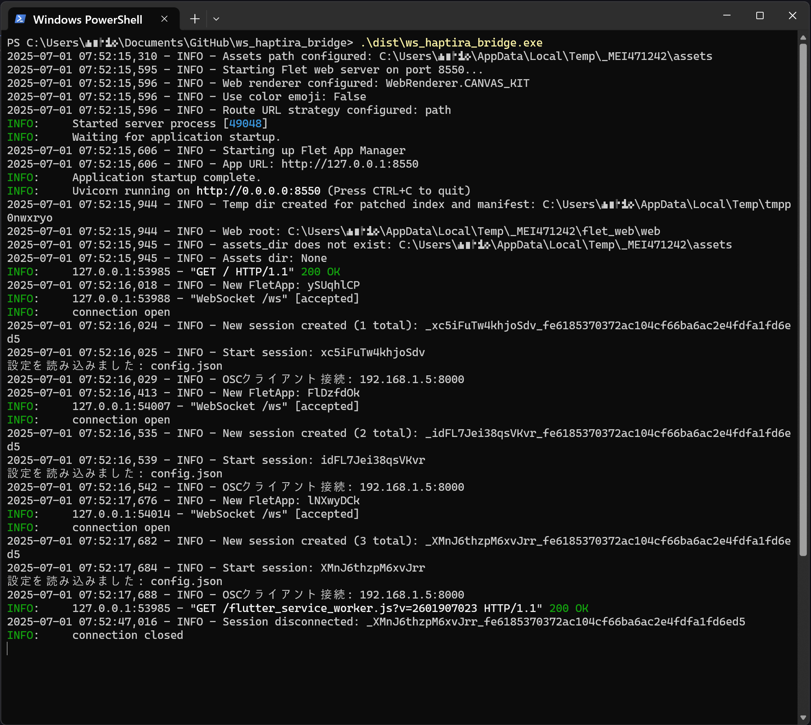

# WebSocket to OSC Bridge

## 概要
buttplug-lite互換のWebSocketサーバーでモーター強度を受け取り、OSCプロトコルでデバイスに送信するPythonアプリケーションです。FletフレームワークによりモダンなWebアプリケーションとして実装されています。

## 特徴
- ✅ **モダンなWebUI**: Fletによるレスポンシブなダークテーマ
- ✅ **リアルタイム制御**: WebSocket経由でのハプティック制御
- ✅ **OSC送信**: HaptiraへOSCメッセージ送信
- ✅ **設定管理**: タグ・チャンネルマッピングの柔軟な設定

## ファイル構成

### 主要ファイル
- `main.py` - メインFletアプリケーション
- `test_app.py` - シンプルなテストアプリケーション
- `bridge.py` - WebSocket-OSCブリッジ機能
- `config.py` - 設定管理
- `websocket_server.py` - WebSocketサーバー
- `osc_client.py` - OSCクライアント

### 設定・ドキュメント
- `requirements.txt` - 依存ライブラリ
- `config.json` - 設定ファイル（自動生成）
- `README.md` - このファイル

## インストール・起動

### 依存関係インストール
```bash
pip install -r requirements.txt
```

### アプリケーション起動
```bash
# Webアプリケーションとして起動
python main.py

# テストアプリケーション起動
python test_app.py
```

### デスクトップアプリとして起動
```python
# main.py内で以下に変更
ft.app(target=main, view=ft.AppView.FLET_APP, port=8000)
```

### EXEファイルを実行する場合

[Release](https://github.com/herbst17904634/websocket_osc_bridge/releases)に掲載されているwebsocket_osc_bridge.exeを適当なフォルダに移動して、ターミナルから実行してください。
起動したターミナルにはコンソールメッセージが表示され、WebブラウザにGUIのページが表示されます。

### コンソール出力


### GUIの操作


1. 左ペイン`タグ・チャンネル設定`で必要なタグ名を入力、チャンネル番号をプルダウンメニューから選択してし、`+`で`現在の設定`に加えます。
1. `OSC設定{OSC IPアドレス:OSCポート}`でHaptiraのIPアドレスとポートを入力し`適用`ボタンを押します。
1. 左ペイン下にある`設定保存`をクリックして設定をファイルに保存します。`設定保存`が見えない場合は左ペインのスクロールバーでスクロールして隠れている部分を表示してください。
1. `テストを送信`ボタンを押してHaptiraにOSCメッセージを送信して、振動モーターが動くことを確認してください。動かない場合はHaptiraの起動状態、IPアドレス、ポート番号、LAN上のHaptiraにpingが届くなどを確認して、障害を探し、解消してから再度テストを送信してください。
1. `ブリッジ開始`ボタンを押してWebSocketサーバーを起動します。
1. [KaniLite(buttplug-lite)](https://github.com/herbst17904634/KaniLite)が受け付ける    WebSocketメッセージ(strenglthのみ)を`ws://localhost:3031`に送るとOSCメッセージがHaptiraに送信されます。テストには弊作[DirectNetVibeTester](https://github.com/herbst17904634/DirectNetVibeTester)などが使えます。

## WebSocket API

### エンドポイント
- **URL**: `ws://localhost:3031`
- **プロトコル**: WebSocket

### メッセージ形式
```
# 単一タグ
tag1:0.5

# 複数タグ
tag1:0.5;tag2:0.8;tag3:0.2
```

### パラメーター
- **strength**: 0.0-1.0の範囲のfloat値

## OSC出力

### メッセージ形式
```
/avatar/parameters/haptira/channel/XX/value,f
```

### パラメーター
- **XX**: チャンネル番号（00-15）
- **f**: float32値（0.0-1.0）

## GUI機能

### 設定パネル
- タグ・チャンネルマッピング設定
- OSC送信先IP/ポート設定
- 設定の保存・読み込み

### 制御パネル
- ブリッジ開始/停止
- テスト送信
- リアルタイム状態表示

### ログパネル
- 動作ログのリアルタイム表示
- ログクリア機能

## 技術仕様

### フレームワーク
- **Flet**: 0.28.3以上
- **Python**: 3.11以上

### 依存ライブラリ
- `flet>=0.28.3` - Webアプリケーションフレームワーク
- `websockets>=15.0.1` - WebSocketサーバー
- `python-osc>=1.9.3` - OSCクライアント

### デプロイメント
- **ローカル**: `python main.py`
- **Web**: ポート8000で自動起動

## 使用例

### VRChatでの使用
1. アプリケーションを起動
2. OSC送信先をVRChatのIPに設定
3. タグとチャンネルをマッピング
4. ブリッジを開始
5. WebSocketクライアントから制御

### 開発・テスト
1. テストアプリケーションで基本動作確認
2. WebSocketクライアントでAPI確認
3. OSC受信側でメッセージ確認

## ライセンス
MIT License

## 開発者
herbst17904634

このプログラムは主にManus AI Agentを用いて作成しました。

